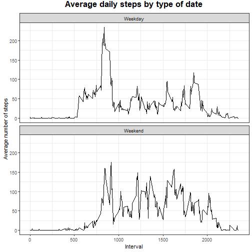

# Course Project 1

## Loading and preprocessing the data

1. Load the data (i.e. read.csv())

2. Process/transform the data (if necessary) into a format suitable for your analysis

**Solution:**

```r
data <- read.csv("activity.csv")
data$date <- as.Date(strptime(data$date, format="%Y-%m-%d"))
```
## What is mean total number of steps taken per day?

1. Calculate and report the mean and median of the total number of steps taken per day

2. If you do not understand the difference between a histogram and a barplot, research the difference between them. Make a histogram of the total number of steps taken each day

**Solution:**

```r
df_steps_per_day <- aggregate(data$steps, by = list(data$date), FUN = sum, na.rm = TRUE)
names(df_steps_per_day) <- c("DAY", "NUMBER_STEPS")
hist(df_steps_per_day$NUMBER_STEPS, main = "Total number of steps taken per day", xlab = "Total steps taken per day", col = "green", ylim = c(0,20), breaks = seq(0,25000, by=2500))
```


3. Calculate and report the mean and median of the total number of steps taken per day

**Solution:**

```r
mean <- mean(df_steps_per_day$NUMBER_STEPS)
median <- median(df_steps_per_day$NUMBER_STEPS)
```
The mean is 9354.2295082, the median is 10395

## What is the average daily activity pattern?

1. Make a time series plot (i.e. type = "l") of the 5-minute interval (x-axis) and the average number of steps taken, averaged across all days (y-axis)

**Solution:**

```r
df_mean_steps_per_interval <- aggregate(data$steps, by = list(data$interval), FUN = mean, na.rm = TRUE)
names(df_mean_steps_per_interval) <- c("INTERVAL", "MEAN_STEPS")
plot(df_mean_steps_per_interval$INTERVAL, df_mean_steps_per_interval$MEAN_STEPS, type = "l", col= "blue", lwd = 2, xlab = "Interval", ylab = "Average number of steps", main="Average number of steps per intervals")
```


2. Which 5-minute interval, on average across all the days in the dataset, contains the maximum number of steps?

**Solution:**

```r
position_max <- grep(max(df_mean_steps_per_interval$MEAN_STEPS), df_mean_steps_per_interval$MEAN_STEPS)
interval_maximum_steps <- df_mean_steps_per_interval[position_max,1]
```

The 5-minute interval, which on average over all days in the dataset, contains the maximum number of steps is: 835

## Imputing missing values

1. Calculate and report the total number of missing values in the dataset (i.e. the total number of rows with NAs

**Solution:**

```r
total_NA_values <- sum(is.na(data$steps))
```

The total number of missing values in the dataset is: 2304

2. Devise a strategy for filling in all of the missing values in the dataset. The strategy does not need to be sophisticated. For example, you could use the mean/median for that day, or the mean for that 5-minute interval, etc.

**Solution:**

```r
data_position <- match(data$interval, df_mean_steps_per_interval$INTERVAL)
values_for_input <- df_mean_steps_per_interval$MEAN_STEPS[data_position]
```

3. Create a new dataset that is equal to the original dataset but with the missing data filled in.

**Solution:**

```r
steps_without_NAs <- ifelse(is.na(data$steps), yes = values_for_input, no = data$steps)
data_without_NAs <- data.frame(steps = steps_without_NAs, data[,2:3])
```

4. Make a histogram of the total number of steps taken each day

**Solution:**

```r
df_steps_per_day <- aggregate(data_without_NAs$steps, by = list(data_without_NAs$date), FUN = sum)
names(df_steps_per_day) <- c("DAY", "NUMBER_STEPS")
hist(df_steps_per_day$NUMBER_STEPS, main = "Total number of steps taken per day without NA values", xlab = "Total steps taken per day", col = "green", ylim = c(0,30), breaks = seq(0,25000, by=2500))
```


- Calculate and report the mean and median of the total number of steps taken per day

**Solution:**

```r
mean <- mean(df_steps_per_day$NUMBER_STEPS)
median <- median(df_steps_per_day$NUMBER_STEPS)
```

The mean is 1.0766189 &times; 10<sup>4</sup>, the median is 1.0766189 &times; 10<sup>4</sup>

- Do these values differ from the estimates from the first part of the assignment? 

**Solution:** yes

- What is the impact of imputing missing data on the estimates of the total daily number of steps?

**Solution:** The impact generated by allocating the NA values in the estimates of the total daily number of steps is that, on the one hand, the frequency of the total number of steps equal to zero decreases (as expected) and the frequency of the total number of steps , whose value was equal to the median, increase, and on the other hand, the mean and median have the same value and their values increase, when NA values are replaced, unlike when this is not done, and I supose, this is It is due to the method that was used to replace the NA values.

## Are there differences in activity patterns between weekdays and weekends?

1. Create a new factor variable in the dataset with two levels – “weekday” and “weekend” indicating whether a given date is a weekday or weekend day.

**Solution:**

```r
data$date_type <- as.factor(sapply(data$date, function(x) {
  if (weekdays(x) == "sábado" | weekdays(x) =="domingo") {y <- "Weekend"} 
  else {y <- "Weekday"}
  return(y)}))
```

2. Make a panel plot containing a time series plot (i.e. type = "l") of the 5-minute interval (x-axis) and the average number of steps taken, averaged across all weekday days or weekend days (y-axis). 

**Solution:**

```r
data_per_date_type <- split(data,data$date_type)
df_mean_steps_per_date <- data.frame()
for (i in data_per_date_type) {
  data1 <- as.data.frame(i)
  names(data1) <- names(data)
  df_mean_steps_per_day <- aggregate(data1$steps, by = list(data1$interval), FUN = mean, na.rm = TRUE)
  names(df_mean_steps_per_day) <- c("interval", "steps")
  df_mean_steps_per_day$date_type <- mapply(rep,data1[1,4] ,nrow(df_mean_steps_per_day))
  df_mean_steps_per_date <- rbind(df_mean_steps_per_date, df_mean_steps_per_day)
}

library(ggplot2)
plot <- ggplot(df_mean_steps_per_date, aes(x = interval , y = steps)) + geom_line() 
plot <- plot + theme_bw() + labs(title = "Average daily steps by type of date", x = "Interval", y = "Average number of steps") 
plot <- plot + facet_wrap(~ date_type, ncol = 1, nrow=2) + theme(plot.title = element_text(face = "bold",size = rel(1.5),vjust = 2.5, hjust = 0.5))
plot
```




